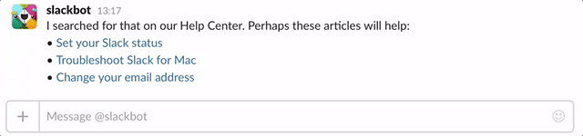

# slack_uberzeit

Minimal Rails 5 app to control your
[uberzeit](https://github.com/ninech/uberzeit) timer via slack.

It's still in very early development, pull requests/issues are very welcome!

## Deploy it!

### Create a slack integration

* Go to https://yourteam.slack.com/apps/manage/custom-integrations
* Slash commands
* Add Configuration:
* Choose A command: /uberzeit (this is what I prefer)
* Fill in the following:
  * URL: https://example.com (we'll change that later)
  * Customize Name: Uberzeit
  * Customize Icon: Just upload an icon you like
  * Autocomplete > Description: Uberzeit timer manager
  * Autocomplete > Usage hint: [configure/info/start/stop]
* Save Integration

### Setup rails app

To setup the basic stuff just run `bin/setup`.

Fill out `.env.production` with your data.

Publish the app under a domain and go back to the slack custom integrations and
change the url to the following: `https://<yourdeployedapp>.com/api`

## Usage

### Commands

The usage of a command is like that:

`/uberzeit <command> <parameters>`

| Command       | Function      | Example  |
| ------------- | ------------- | -------- |
| configure     | Configures the api token for uberzeit | /uberzeit configure api-token |
| start         | Starts a timer on the current time. Forgot to start your
| timer? you can easily pass an argument which would be the time you started the
| timer. | /uberzeit start 08:35
| stop          | Stops the current timer | /uberzeit stop |
| info / empty  | Shows how long you've been working for.  | /uberzeit or /uberzeit info

## Contributing

Bug reports and pull requests are welcome on GitHub at https://github.com/siegy22/slack_uberzeit. This project is intended to be a safe, welcoming space for collaboration, and contributors are expected to adhere to the [Contributor Covenant](contributor-covenant.org) code of conduct.

## License

The gem is available as open source under the terms of the [MIT License](http://opensource.org/licenses/MIT).
